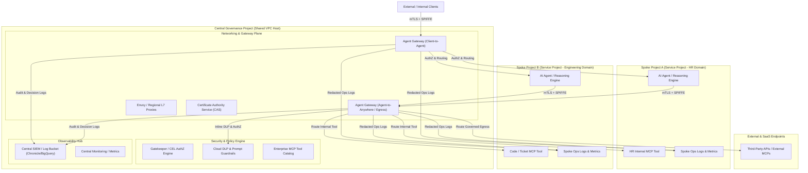

# Centralized Cross-Project Agent Gateway: Architecture & Governance Design

## 1. Executive Summary

This architecture design document establishes the blueprint for **Centralized Governance of Agent Gateway** across a multi-project Google Cloud environment. In this design, a dedicated **Central Governance Project** acts as the single administrative and security control plane for all networking, security policies, tool access, and observability, while distributed **Spoke (Workload) Projects** deploy AI agents, reasoning engines, tools, and client applications.

---

## 2. Architectural Overview & Topology

---

## 3. Core Design Decisions

| Pillar | Architectural Decision | Key Implementation Details |
| :--- | :--- | :--- |
| **Network Topology** | **Shared VPC (Central Host Project)** | Central Governance Project acts as Shared VPC Host. Spoke service projects attach to dedicated subnets. All L7 proxies, Envoy filters, and Agent Gateways run centrally. |
| **Traffic Direction** | **Full-Duplex (Ingress & Egress)** | **Ingress (`CLIENT_TO_AGENT`)**: Inbound routing, rate limiting, and client authentication. **Egress (`AGENT_TO_ANYWHERE`)**: Outbound agent tool-calling, MCP connectivity, and external API egress governance. |
| **Identity & Auth** | **Zero Trust mTLS with SPIFFE IDs** | Cryptographic mutual TLS backed by Google Cloud Certificate Authority Service (CAS). Per-request authorization evaluated directly against caller SPIFFE identities (`spiffe://<project>/ns/<ns>/sa/<sa>`). |
| **Observability** | **Centralized SIEM + Sliced Spoke Logs** | Full audit logs, policy decisions, and payload metadata flow to central Log Bucket / BigQuery / Chronicle sink. Redacted operational logs and metrics are exported to respective spoke projects based on SPIFFE identity. |
| **Tool / MCP Registry** | **Hybrid Tool Governance** | Central catalog for vetted enterprise-wide MCP tools; federated registration for spoke-specific tools subject to central Gatekeeper policies. |
| **Data Protection & Guardrails** | **Inline Policy-Driven Inspection** | Inline Envoy/Gateway filters perform prompt injection validation, JSON Schema verification, and Cloud DLP masking/redaction based on destination risk profile. |
| **Infrastructure & CI/CD** | **Terraform / CI/CD Pipelines** | Spoke teams declare route bindings and service definitions in Terraform / Cloud Deploy using cross-project IAM service accounts with least-privilege gateway binding permissions. |

---

## 4. Component Details & Workflows

### 4.1. Zero Trust Identity & Cross-Project Transport (mTLS)
1. **Certificate Issuance**: Google Cloud CAS issues short-lived X.509 workload certificates with embedded SPIFFE URIs to workloads in both central and spoke projects.
2. **Gateway Handshake**: When an agent in a spoke project initiates an MCP tool call, Envoy in the central project completes an mTLS handshake, verifying the client certificate against the central trust bundle.
3. **SPIFFE Attribute Extraction**: The gateway extracts:
   - Calling Project ID / Number
   - Service Account Name
   - Target URI & MCP Method
4. **Gatekeeper AuthZ**: Gatekeeper evaluates CEL authorization rules against the extracted SPIFFE attributes before dispatching the request.

### 4.2. Egress & Tool Governance Workflow
1. **Tool Invocation Request**: Agent in Spoke Project calls `https://agentgateway.internal/mcp/v1/tools/call`.
2. **Schema & Policy Verification**: Gateway verifies if the caller SPIFFE ID is authorized to invoke the target tool and checks tool parameter schemas.
3. **Inline DLP / Sensitive Data Masking**: Request payload is passed through Cloud DLP inspection rules. Sensitive patterns (e.g., credentials, PII) are masked or rejected based on policy.
4. **Target Dispatch**: Request is routed to the target MCP server (internal spoke subnet or egress gateway).
5. **Response Guardrails**: Response is inspected for prompt leakage or unauthorized data exfiltration before being returned to the agent.

### 4.3. Observability & Sliced Telemetry
- **Central SIEM Log Sink**:
  - `gwslog` / Agent Gateway Audit Logs: Captures `caller_spiffe_id`, `source_project`, `target_tool`, `policy_decision`, `dlp_findings`, `latency_ms`, `http_status`.
  - Retention: Long-term compliance retention in BigQuery / Chronicle.
- **Spoke Project Log Router**:
  - Log sinks configured with filter: `jsonPayload.spoke_project_id = "spoke-project-a"`.
  - Operational metrics (request rates, error rates, p95 latencies) emitted to Spoke Cloud Monitoring dashboards.

---

## 5. Next Steps & Implementation Roadmap

1. **Phase 1: Shared VPC & Network Services Setup**
   - Configure Shared VPC subnets and routing in the Central Governance Project.
   - Deploy Certificate Authority Service (CAS) and configure Envoy mTLS profiles.
2. **Phase 2: Agent Gateway Deployment & AuthZ Configuration**
   - Deploy Agent Gateway instances for Ingress (`CLIENT_TO_AGENT`) and Egress (`AGENT_TO_ANYWHERE`).
   - Define Gatekeeper / CEL authorization templates for SPIFFE-based access control.
3. **Phase 3: Hybrid Tool Catalog & DLP Pipeline**
   - Stand up the central enterprise MCP tool catalog.
   - Configure inline Cloud DLP inspection templates and prompt guardrail policies.
4. **Phase 4: Observability Sinks & Terraform CI/CD Modules**
   - Provision central BigQuery/SIEM audit sinks and spoke project log export filters.
   - Release Terraform modules enabling spoke teams to onboard agents and routes via CI/CD.
